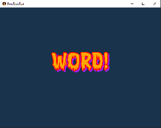

# FreeTypeTest

A [libGDX](https://libgdx.com/) project generated with [gdx-liftoff](https://github.com/tommyettinger/gdx-liftoff).

Test of freetype font rendering on different platforms.

FreeType is not supported on GWT and will raise a compile error.  (There is an add-on library for this).

The drop shadow does not work (causes a crash) on teamvm version b6 (unhandled exception caught TypeError: var$11.$getRealPixels is not a function) but works on SNAPSHOT since 6 Sep 2023.

Note that generating a font on teamvm does take some time, esp. for big fonts (maybe a few seconds) so do that in a load screen.

### Text Garbling

Note that for big font sizes text can appear garbled or letters go missing. E.g. by default for font sizes above 120.
You can use generator.setMaxTextureSize(2048); for fonts up to ca. 240 pixels.
What also really helps is to define a character set  e.g.         
    parameter.characters = "ABCDEFGHIJKLMNOPQRSTUVWXYZ0123456789!";
rather than needing texture space for by default 225 characters.

## Platforms

- `core`: Main module with the application logic shared by all platforms.
- `lwjgl3`: Primary desktop platform using LWJGL3.
- `html`: Web platform using GWT and WebGL. Supports only Java projects.  NOT SUPPORTED
- `teavm`: Experimental web platform using TeaVM and WebGL.

